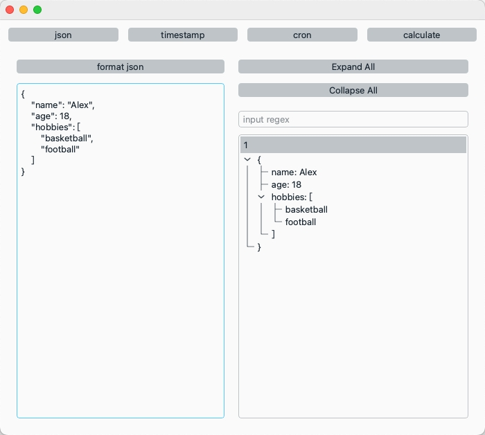

## 开发小工具集合
[](https://github.com/RichardLitt/standard-readme)

使用PySide6开发。主要包含一下功能：
- 时间和时间戳相互转换
- json格式化
- 查询crontab表达式执行时间
- 简易python repl


## 界面展示




## 打包成可执行文件
```bash
make app
```
执行完后会生成app文件：./dist/DevTools.app，将其拖入应用程序文件夹即可使用

同时会自动打开生成的app文件

## Maintainers

[@vzpd](https://github.com/vzpd)


## Contributing

Feel free to dive in! [Open an issue](https://github.com/vzpd/DevTools/issues/new) or submit PRs.


## License

[MIT](LICENSE) © vzpd